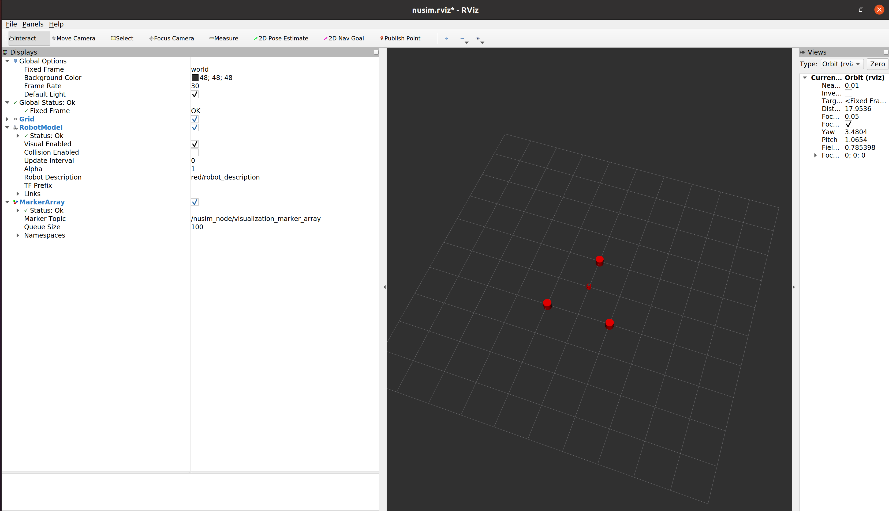

# Nusim  Description

This package spawns a turtlebot with obstacles in RViz with services to restart and teleport. 

### Launch Files ###
* nusim.launch

        roslaunch nusim nusim.launch
    
    Launches a red turtlebot in RViz with obstacles specified in initial.yaml

* To see four copies of the robot in rviz:

        roslaunch nuturtle_description load_all.launch

### Parameters ###
* rate.yaml
    * Edit the ros::Rate
* initial.yaml
    * Configure the spawn point of the turtlebot
        * x0: initial turtlebot x position
        * y0: initial turtlebot y position
        * theta0: intiial turtlebot orientation
    * Add any number of obstacles in the RViz environment
        * obj_x: list of x coordinates for the obstacles
        * obj_y: list of y coordinates for the obstacles
        * obj_d: list of diamters for the obstacles
 
### Services ###
* Restart
    
        rosservice call /nusim_node/Restart 
    Sends the turtle back to the origin of the world frame with 0 rotation
* Teleport
        
        rosservice call /nusim_node/Teleport "x: 0.0 y: 0.0 w: 0.0"

    Sends the turtle to the specified location and rotation

