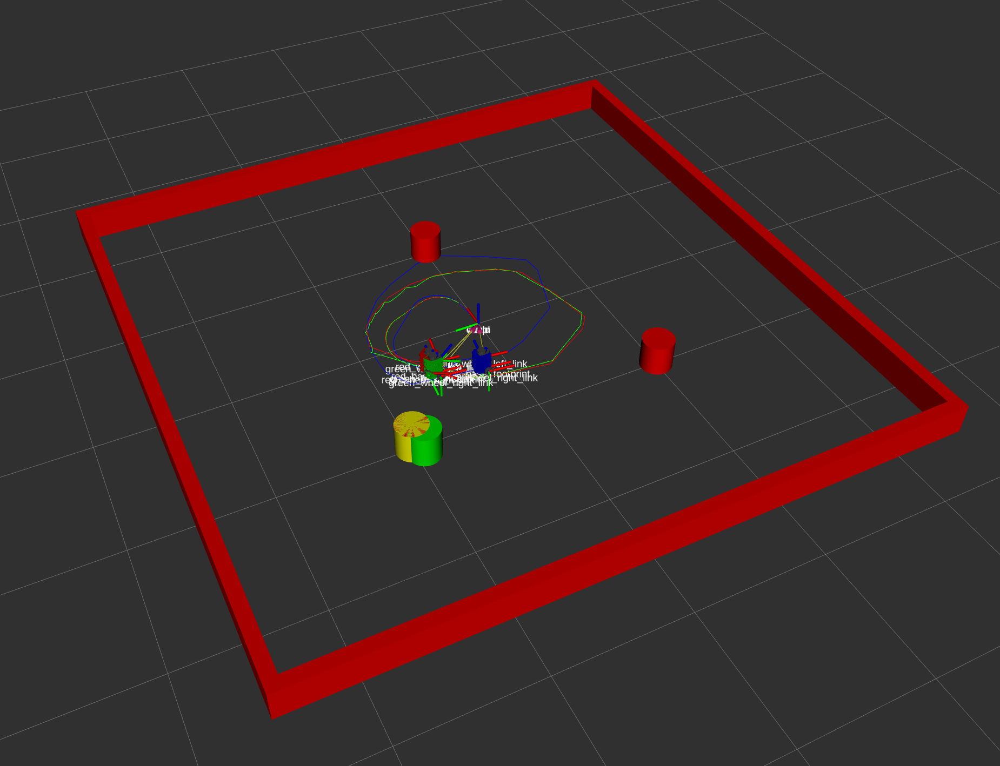

The kalman filter library is currently under construction and should not be used. The nuslam node, however, is fully functional and simulates a turtlebot navigating turtlebot using teleop keyboard control. 

        roslaunch nuslam slam.launch

Red: The state of the simulated real-world 
Yellow: The state according to the LiDAR sensor 
Blue: The state according to odometry 
Green: The state according to the kalman filter
