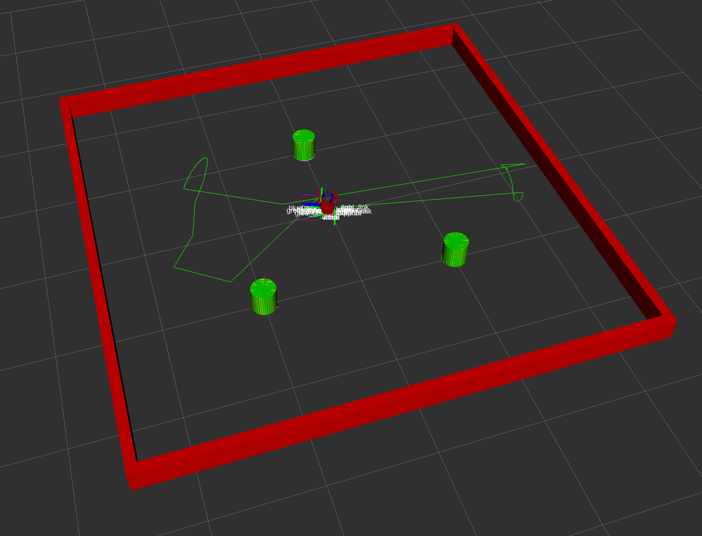

The kalman filter library is currently under construction and should not be used. The nuslam node, however, is fully functional and simulates a turtlebot navigating turtlebot using teleop keyboard control. Adding unknown_data_assoc incorporates LiDAR data with automatic data association for the turtlebot to localize itself in the map. 

To run the simulation with only localization, using the fake_sensor topic rather than the more realistic sensor with data assoication, run the slam.launch file. This simulation is fully functional.

        roslaunch nuslam slam.launch

To run the simulation with a realistic representation of LiDAR data and an attempt at associating the data, run the unknown_data_assoc.launch file.

        roslaunch nuslam unknown_data_assoc.launch

#### EKF SLAM With Fake Sensor Data (No Data Association)

Red: The state of the simulated real-world 

Yellow: The state according to the fake sensor data

Blue: The state according to odometry 

Green: The state according to the kalman filter

#### EKF SLAM With Realistic Sensor Data (Including Data Association)

Yellow: The state according to the clustered and circle-fit LiDAR sensor data

Blue: The state according to odometry 

Green: The state according to EKF SLAM

|Robot|Starting Location|Ending Location|Error| 
|---------|----------|---------|-----|
|Red| (0,0) | (0.0670, 0.0091) | (0,0)
|Green| (0,0) | (0.06989, 0.00905) | (.00198,-0.00005)
|Blue| (0,0) | (0.1175,-0.00164) | (0.0505, -0.01074)

EKF SLAM outperformed odometry! 