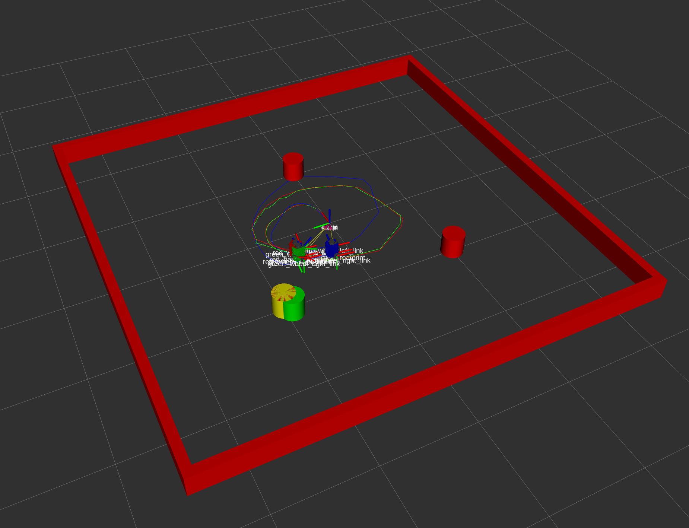
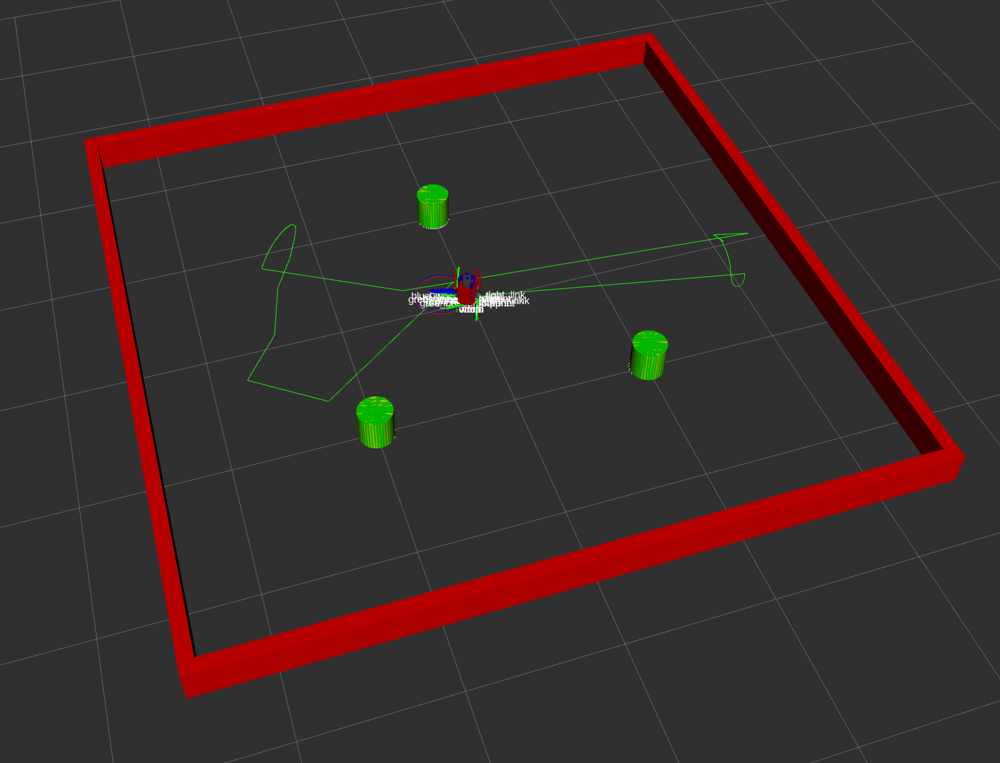
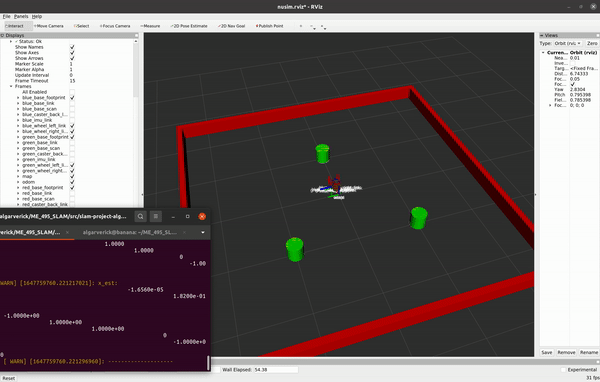

The nuslam node simulates a turtlebot navigating using teleop keyboard control. Adding unknown_data_assoc incorporates LiDAR data with data association for the turtlebot to localize itself in the map. 

To run the simulation with known landmark locations (easy mode):

        roslaunch nuslam slam.launch

To run the simulation with simuated LiDAR data and data association (unknown landmark associaion -- hard mode):

        roslaunch nuslam unknown_data_assoc.launch

The simulation will open an RVIZ window that displays 4 color-coded representations of the robot and landmarks. The red robot is the ground-truth and is controlled with standard tele-op keyboard commands. The yellow, green, and blue robots represent different state estimations.  

#### EKF SLAM With Fake Sensor Data (known landmark locations, no data association)

This image shows 4 representations of the state. The red is the ground-truth, and the yellow will be an exact copy of the red because the landmarks locations are given directly to the fake_sensor topic. The blue robot follows the path of the red robot according to odometry, so it moves ahead gradually deviate paths as error accumulates due to the tire slip. The green robot may get confused as information is added and taken away from the filter, but will eventually find its way back to the red robot's location.

Red: The state of the simulated real-world 

Yellow: The state according to the fake sensor data

Blue: The state according to odometry 

Green: The state according to the kalman filter

#### EKF SLAM With Realistic Sensor Data (initially unknown landmark locations)

This image similarly shows 4 representations of the state. The red is the same ground truth as the first image, but the yellow now varies slightly as it is an estimation of the landmark locations from LiDAR range data. The blue behaves similarly because it is indifferent to the landmarks, but the green may not perform as well if the landmark leave the sensor range or an estimation is not reliable. However, unlike the odometry state estimation, the Kalman Filter will not accumulate error and is able to reset the state estimation as more information become available, making it the most accurate over time.

Red: The state of the simulated real-world 

Yellow: The state according to the clustered and circle-fit LiDAR sensor data

Blue: The state according to odometry 

Green: The state according to EKF SLAM

|Robot|Starting Location|Ending Location|Error| 
|---------|----------|---------|-----|
|Red| (0,0) | (0.0670, 0.0091) | (0,0)
|Green| (0,0) | (0.06989, 0.00905) | (.00198,-0.00005)
|Blue| (0,0) | (0.1175,-0.00164) | (0.0505, -0.01074)

EKF SLAM outperformed odometry! 

