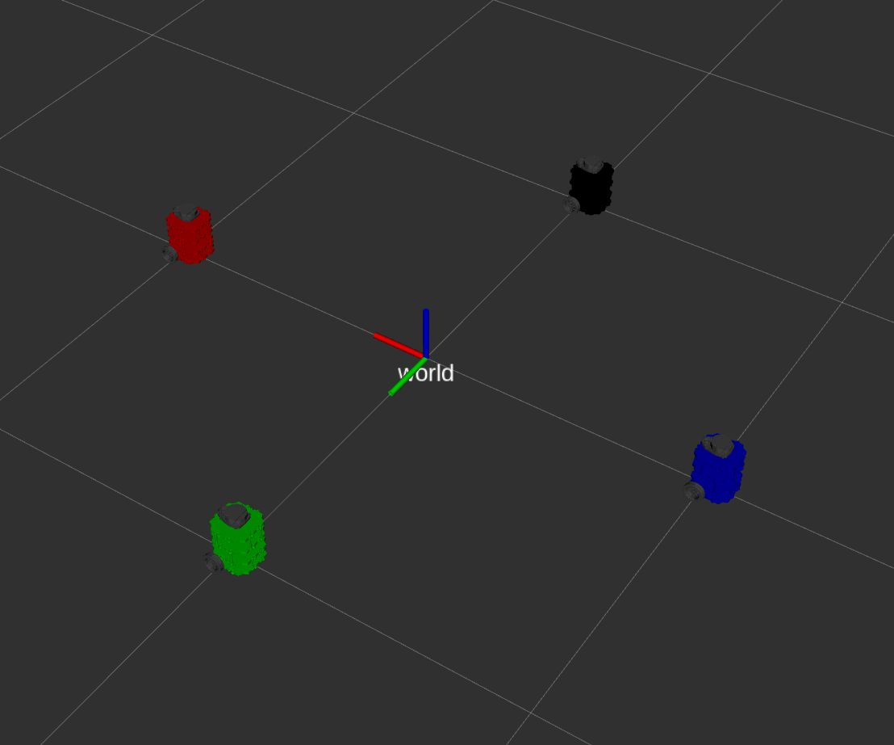

# Nuturtle  Description

URDF files for Nuturtle BananaBot (TurtleBot3)

This package loads a visualization of the Turtlebot3 in RVIZ

* To see the a single model in rviz:

        roslaunch nuturtle_description load.launch use_jsp:=true
   With arguments:
   
   * use_rviz -- to open an rviz window, default true
   * use_jsp -- to use the joint state publisher, default false 
   * color -- choose the color of the model, must be an a color known in the xacro documentation, default black

* To see four copies of the robot in rviz:

        roslaunch nuturtle_description load_all.launch

